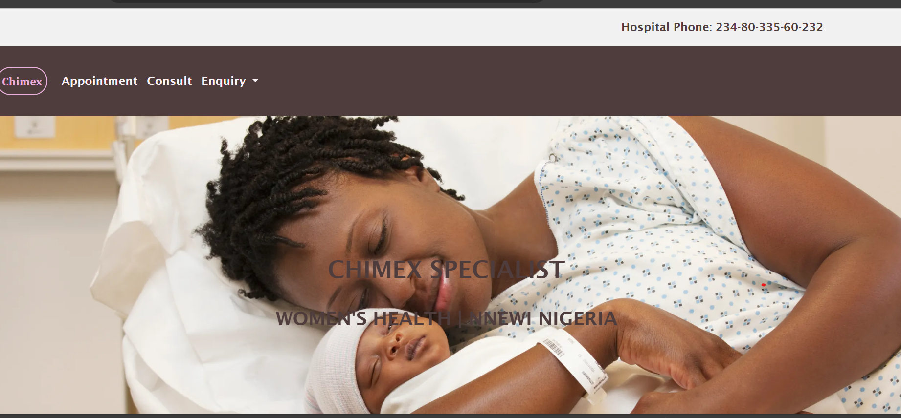
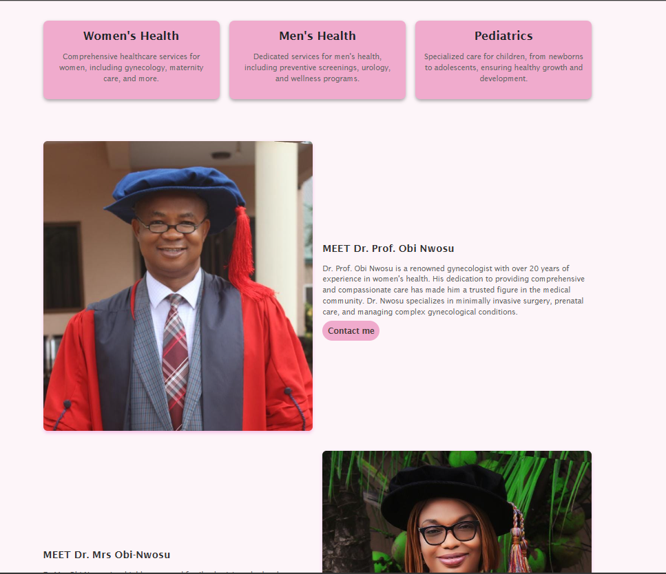
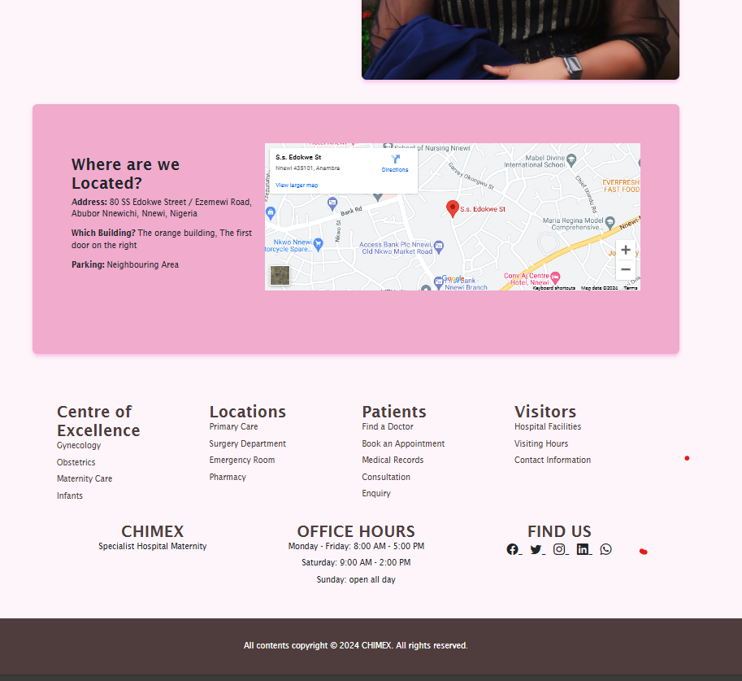

# Chimex Maternity Hospital Website

Welcome to the Chimex Maternity Hospital website repository. This project is a website for a maternity hospital named Chimex, located in Nnewi, Nigeria. The website provides information about the hospital's services, doctors, location, and more. It also allows users to make appointments, consult, and send enquiries.

## Table of Contents
- [Technologies Used](#technologies-used)
- [Features](#features)
- [Setup](#setup)
- [Folder Structure](#folder-structure)
- [Usage](#usage)
- [Contributing](#contributing)
- [License](#license)

## Technologies Used
- HTML
- CSS
- JavaScript
- TypeScript
- JSON
- Bootstrap 5

## Features
- Home page with hospital information.
- Appointment booking system.
- Consultation and enquiry forms.
- Detailed information about doctors and services.
- Google Maps integration for location.
- Responsive design using Bootstrap 5.

## Setup
To get a local copy up and running, follow these simple steps:

### Prerequisites
- Web browser (Chrome, Firefox, etc.)
- Code editor (VS Code, Sublime Text, etc.)
- [Node.js](https://nodejs.org/) (for any JavaScript/TypeScript development if needed)

### Installation
1. Clone the repository:
   ```sh
   git clone https://github.com/yourusername/chimex-maternity-hospital.git

Navigate to the project directory
## Usage
Home Page: Contains general information about Chimex Maternity Hospital.
Appointment Page: Allows users to book appointments online.
Consultation Page: Provides options for different consultations.
Enquiry Page: Allows users to make various enquiries.
Admin Dashboard: For managing appointments and contact inquiries (restricted access).
# Contributing
Contributions are what make the open-source community such an amazing place to be. Any contributions you make are greatly appreciated.

If you have a suggestion that would make this better, please fork the repo and create a pull request. You can also simply open an issue with the tag "enhancement".
Don't forget to give the project a star! Thanks again!

# Fork the Project
Create your Feature Branch (git checkout -b feature/AmazingFeature)
Commit your Changes (git commit -m 'Add some AmazingFeature')
Push to the Branch (git push origin feature/AmazingFeature)
Open a Pull Request


# License


## Screenshots
- Home page 



- Appointment Page
- 
- in progress
- Contact Page
in progress

- in progress
## Contact
- Christabel Obi-Nwosu - [my_github](https://github.com/Christabel091)

- email - obinwosugosiorah@gmail.com

- [Project_Link:](https://github.com/Christabel091/hospital-clinic-website)


## Project Status

This project is currently in progress. We are actively working on implementing core features and ensuring the system is robust and user-friendly. Contributions and suggestions are welcome as we continue to develop this project.
